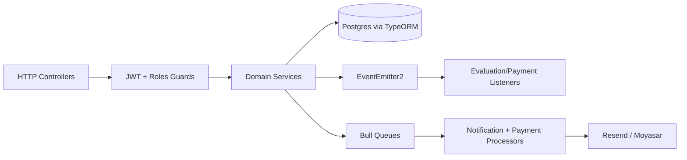
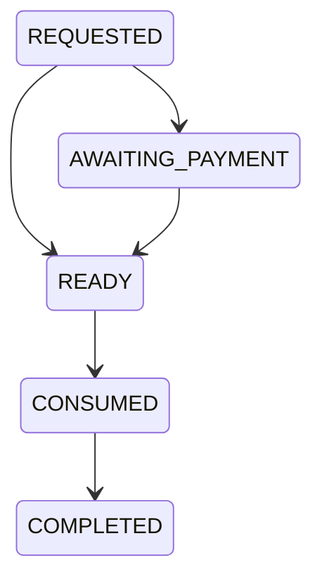
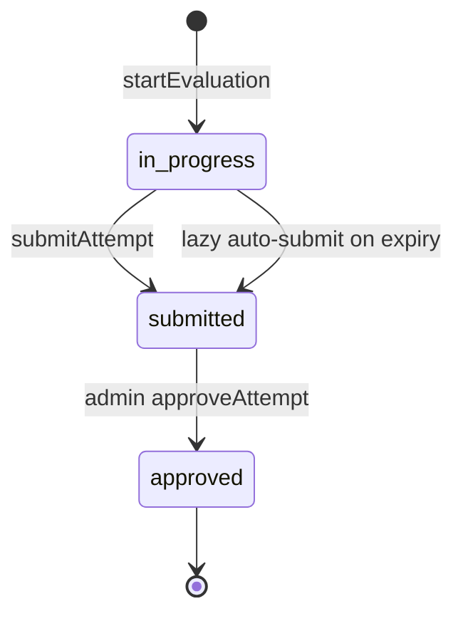

# 1. Project Overview

This repository is a NestJS 11 backend for an educational/child-development platform. The system manages organizations, organization owners, teachers, parents, children, evaluations, payments for private extra attempts, in-app/email notifications, and a small deals/proposals marketplace for enrichment providers.

The main business domain is child evaluation and institutional child management:

- Organizations sign up and own grades/classes/teachers.
- Parents own children and start/submit evaluations for those children.
- Organization owners view class-level evaluation reporting and can send reminders.
- Admins create evaluation definitions, approve submitted evaluation attempts, seed roles, and approve paid extra private attempts.
- Enrichers/service providers receive deal opportunities and submit proposals.

Main actors are defined in [src/common/enums/role.enum.ts](src/common/enums/role.enum.ts):

```ts
export enum UserRole {
  ADMIN = 'ADMIN',
  ORGANIZATIONOWNER = 'ORGANIZATIONOWNER',
  ENRICHER = 'ENRICHER',
  TEACHER = 'TEACHER',
  PARENT = 'PARENT',
}
```

Important caveat: multiple files still reference `UserRole.EMPLOYEE`, but that enum member does not exist. Current `cmd /c npm run build` fails because of this and because evaluation services reference missing `Child.organization` / `Child.user` relations.

Core workflows:

- Auth: phone/password login, organization/enricher signup, JWT access tokens, refresh-token sessions, email verification through queued email.
- Institutional management: organization owners create grades, classes, teachers, and children with auto-created parent accounts.
- Private parent flow: parent creates up to two private children, opens a main evaluation slot, starts an evaluation, submits answers, optionally requests retake and paid extra attempts.
- Evaluation flow: admin creates evaluation schema; parent starts attempt; parent saves progress; submit scores answers; admin approves; listeners notify parent.
- Payment flow: checkout session through Moyasar; webhook is signature-checked, deduplicated, queued, verified against provider, then emits `payment.success`/`payment.failed`.
- Notification flow: code enqueues Bull jobs; queue worker sends email through Resend and/or persists in-app notifications.
- Deals flow: organization-side actor creates deal for an activity; enrichers submit/update proposals before deadline; notifications are sent to enrichers and organization owners.

# 2. System Architecture

The application is a modular NestJS monolith using TypeORM repositories over PostgreSQL, Bull/Redis queues, EventEmitter2 domain events, and Resend/Moyasar external integrations.

Entry points:

- [src/main.ts](src/main.ts) creates the Nest app with `rawBody: true`, global `ValidationPipe`, CORS `origin: '*'`, global prefix `api`, and Swagger at `/api-docs`.
- [src/app.module.ts](src/app.module.ts) wires global `JwtAuthGuard`, global `RolesGuard`, `ClassSerializerInterceptor`, TypeORM, Bull, scheduler, and all domain modules.

High-level flow:



Important infrastructure modules:

- `ConfigModule.forRoot({ isGlobal: true })` makes environment config available.
- `BullModule.forRootAsync` configures Redis from `REDIS_HOST`, `REDIS_PORT`, `REDIS_PASSWORD`, `REDIS_TLS`.
- `EventEmitterModule.forRoot({ wildcard: true, delimiter: '.', maxListeners: 50 })` supports events such as `evaluation.submitted`.
- `ScheduleModule.forRoot()` enables payment expiry and retry cron jobs.

Configuration risk in [src/app.module.ts](src/app.module.ts): TypeORM uses `port: Number(process.env.DB_HOST)` instead of `DB_PORT`, and `synchronize: Boolean(process.env.DB_SYNCHRONIZE)` treats any non-empty string, including `"false"`, as true.

Module responsibilities:

- `UsersModule`: users, roles, auth, signup strategies, teachers, parent/enricher placeholder controllers.
- `OrganizationsModule`: organization lookup/update and membership checks.
- `GradesModule` / `ClassesModule`: organization-owned academic structure.
- `ChildrenModule`: child CRUD, private child creation, private attempt entitlement slots, payment-success slot unlocks.
- `EvaluationsModule`: evaluation definitions, attempts, answers, scoring, approvals, organization owner reports.
- `PaymentsModule`: checkout creation, Moyasar provider, webhook queue, payment expiry/retry cron, payment success/failure events.
- `NotificationsModule`: in-app notifications, email dispatch, queue processor, evaluation event listeners.
- `DealsModule`: activities, deals, proposals.
- `TestsModule`: older/simple test-assignment system separate from the newer evaluation system.
- `UploadsModule` and `MailerModule`: basic file upload and direct mail endpoints.

Event-driven behavior:

- [src/evaluations/evaluations.events.ts](src/evaluations/evaluations.events.ts): `evaluation.submitted`, `evaluation.approved`, `evaluation.limit_reached`.
- [src/notifications/listeners/evaluation-notifications.listener.ts](src/notifications/listeners/evaluation-notifications.listener.ts): turns evaluation events into in-app notifications.
- [src/payments/payments.events.ts](src/payments/payments.events.ts): `payment.success`, `payment.failed`.
- [src/children/private-child-attempts.service.ts](src/children/private-child-attempts.service.ts): listens to `payment.success` and unlocks private extra attempt slots.

# 3. Database & Entities

There are no TypeORM migration files in the repository. Schema is inferred from decorators and currently depends on `synchronize` if enabled.

## Users, Roles, Organizations

[src/users/entities/user.entity.ts](src/users/entities/user.entity.ts)

- Purpose: base account for all actors.
- Columns: `id`, `name`, unique `email`, unique `phone`, `password`, verification flags, timestamps.
- Roles: `ManyToMany(User <-> Role)` with eager loading and a generated join table.
- Ownership: a user can own one organization via `ownedOrganization`.
- Membership: a user can belong to an organization via nullable `ManyToOne organization`, with `onDelete: SET NULL`.
- Children: defines `children` inverse as `(child) => child.user`, but `Child` has no `user` property. This is a real compile/schema mismatch. `parentChildren` points to `(child) => child.parent`.

[src/users/entities/user-roles.entity.ts](src/users/entities/user-roles.entity.ts)

- `Role` has unique `name` and inverse many-to-many users.
- `UsersService.onModuleInit()` seeds roles, but currently includes missing `UserRole.EMPLOYEE`.

[src/organizations/entities/organization.entity.ts](src/organizations/entities/organization.entity.ts)

- Purpose: institution owned by a user.
- Columns: `organizationName`, `organizationType`, `approvalStatus`, unique `ownerId`.
- `OneToOne owner` uses `@JoinColumn({ name: 'ownerId' })` and `onDelete: CASCADE`, so deleting owner deletes organization.
- `OneToMany users`, `teachers`, `parents`, `grades`, `classes` are inverse relations. `parents` and `users` both use `User.organization`.
- Approval status defaults to `pending`.

[src/users/entities/teacher.entity.ts](src/users/entities/teacher.entity.ts)

- Purpose: teacher profile attached to a user and organization.
- Has scalar `userId`, `orgId`.
- `OneToOne user` with `@JoinColumn({ name: 'userId' })`, `onDelete: CASCADE`.
- `ManyToOne organization` with `@JoinColumn({ name: 'orgId' })`, `onDelete: CASCADE`.
- `OneToMany classes` inverse.

[src/users/entities/enricher.entity.ts](src/users/entities/enricher.entity.ts)

- Purpose: service provider/enricher profile.
- `OneToOne user` with cascade delete and default approval status `pending`.

## Academic Structure

[src/grades/entities/grade.entity.ts](src/grades/entities/grade.entity.ts)

- Purpose: organization-owned grade.
- `ManyToOne organization` with `onDelete: CASCADE`.
- `OneToMany classes`.
- `name` is typed as `GradeName` but stored with a plain `@Column()` rather than TypeORM enum metadata.

[src/classes/entities/class.entity.ts](src/classes/entities/class.entity.ts)

- Purpose: grade-level class under an organization.
- `ManyToOne grade`, `onDelete: CASCADE`.
- `ManyToOne teacher`, nullable, `onDelete: SET NULL`, joined by `teacherId`.
- `ManyToOne organization`, `onDelete: CASCADE`, joined by `orgId`.
- `OneToMany children`.
- Hidden coupling: class stores both `grade` and `organization`; grade also stores organization. Code assumes they match, but no DB constraint enforces it.
- Mapping bug: the `Class.organization` inverse currently points to `(org) => org.grades`, not `(org) => org.classes`.

## Children

[src/children/entities/child.entity.ts](src/children/entities/child.entity.ts)

- Purpose: child profile target for tests/evaluations.
- Columns: `name`, `birthDate`, `gender`, `classId`, `createdById`, timestamps.
- `classId` column is declared `@Column({ type: 'uuid' }) classId: string | null`, while relation is nullable. The column itself lacks `nullable: true`, conflicting with private children that use `classId = null`.
- `ManyToOne class` joined by `classId`, nullable, `onDelete: CASCADE`. Private children are represented by no class.
- `ManyToOne createdBy` joined by `createdById`, `onDelete: CASCADE`.
- `ManyToOne parent` joined by `parentId`, `onDelete: CASCADE`; there is no scalar `parentId` property even though many queries rely on generated DB column.
- `OneToOne profile`.
- `OneToMany slots` to `EvaluationSlot`.
- Critical mismatch: services frequently write/read `organization` and `user` on `Child`, but the entity does not define those relations.

[src/children/entities/child-profile.entity.ts](src/children/entities/child-profile.entity.ts)

- Optional one-to-one extension with diagnoses, notes, status. It owns the join column to child.

[src/children/entities/child-report.entity.ts](src/children/entities/child-report.entity.ts)

- Legacy/simple report tied to `TestAssignment`, with `scoreJson`.

## Evaluation System

[src/evaluations/entities/evaluation.entity.ts](src/evaluations/entities/evaluation.entity.ts)

- Purpose: evaluation definition/template.
- Columns: `type`, nullable `ageFrom`/`ageTo`, `evaluatorTypes`, `title`, `institutionId`.
- `institutionId` is a raw UUID, not a TypeORM relation to `Organization`.
- Cascading one-to-many definitions: `questions`, `dimensions`.

[src/evaluations/entities/evaluation-dimension.entity.ts](src/evaluations/entities/evaluation-dimension.entity.ts)

- Purpose: scoring dimension under an evaluation.
- Unique `(evaluationId, code)`.
- Joined by `evaluation_id`, `onDelete: CASCADE`.
- Contains score bounds and JSONB `interpretationRules`.

[src/evaluations/entities/evaluation-question.entity.ts](src/evaluations/entities/evaluation-question.entity.ts)

- Purpose: question under evaluation and dimension.
- Has scalar `evaluationId` and `evaluationDimensionId`.
- `ManyToOne evaluation` and dimension, both cascade delete.
- Cascades child `answers`.

[src/evaluations/entities/evaluation-question-answer.entity.ts](src/evaluations/entities/evaluation-question-answer.entity.ts)

- Purpose: answer option with hidden `scoreValue`.
- Joined to question by `questionId`, cascade delete.
- Optional `code`, ordered by `order`.

[src/evaluations/entities/evaluation-attempt.entity.ts](src/evaluations/entities/evaluation-attempt.entity.ts)

- Purpose: a parent-child execution of one evaluation.
- Unique `(evaluationId, parentId, childId, attemptNumber)`.
- Indexed lookup `(evaluationId, parentId, childId)`.
- Status enum: `in_progress`, `submitted`, `approved`.
- `attemptNumber` is sequential per evaluation-parent-child.
- `expiresAt` allows time-limited attempts; expiration is checked lazily on read/save, not by cron.
- `score` stores total numeric score when applicable.
- `result` stores the full scoring output JSONB.
- `answers` cascades on attempt save/delete.
- `approval` one-to-one optional.

[src/evaluations/entities/evaluation-answer.entity.ts](src/evaluations/entities/evaluation-answer.entity.ts)

- Purpose: selected answer per question for an attempt.
- Unique `(attemptId, questionId)`, which powers progress upsert.
- Stores denormalized `scoreValue` and `evaluationDimensionId` from the selected answer/question at save time.
- All foreign relations cascade delete.

[src/evaluations/entities/evaluation-approval.entity.ts](src/evaluations/entities/evaluation-approval.entity.ts)

- Purpose: one admin approval record per attempt.
- Unique `attemptId`; stores raw `approvedBy` UUID and `approvedAt`.

[src/evaluations/entities/evaluation-slot.entity.ts](src/evaluations/entities/evaluation-slot.entity.ts)

- Purpose: entitlement ledger for private-child attempts.
- Table name is `evaluation_slot`.
- Slots have `childId`, `parentId`, `kind` (`MAIN`, `RETAKE`, `EXTRA`), `status`, deprecated `isPaid`, `requiresApproval`, nullable `evaluationAttemptId`, nullable `paymentId`.
- Status machine in `transitionTo()`:



- Note: TypeScript numeric enum values are used for `SlotKind` (`MAIN=0`, `RETAKE=1`, `EXTRA=2`) because the enum has no string values.

## Payments

[src/payments/entities/payment.entity.ts](src/payments/entities/payment.entity.ts)

- Purpose: local payment ledger.
- `userId` required; `childId` and `privateAttemptId` nullable.
- Amount is numeric(12,2) string in SAR major units.
- Provider enum currently supports Moyasar/Paytabs/Hyperpay, but `PaymentsService.resolveProvider()` only allows the active provider implementation.
- Indexed pending expiry `(status, expiresAt)`.
- Metadata JSON stores business refs like `childId`, `attemptRequestId`, `privateAttemptId`.

[src/payments/entities/payment-webhook-dedup.entity.ts](src/payments/entities/payment-webhook-dedup.entity.ts)

- Purpose: webhook idempotency by `(providerPaymentId, payloadHash)`.
- This dedupes identical payloads, but different payloads for the same provider payment are processed separately.

## Notifications

[src/notifications/entities/notification.entity.ts](src/notifications/entities/notification.entity.ts)

- Purpose: persisted in-app notification.
- `ManyToOne user`, `onDelete: CASCADE`, explicit `userId`.
- Indexed by `user` and `createdAt`.
- Supports `type`, `metadata`, `isRead`.

## Deals

[src/deals/entities/activity.entity.ts](src/deals/entities/activity.entity.ts): reusable activity category with deals.

[src/deals/entities/deal.entity.ts](src/deals/entities/deal.entity.ts)

- Purpose: organization request for provider proposals.
- `ManyToOne activity` with `onDelete: RESTRICT`.
- `ManyToOne organization` cascade delete.
- `ManyToOne creator` with `onDelete: RESTRICT`.
- `studentsCount`, `status` (`OPEN`/`CLOSED`), `deadline`.
- Indexed by organization/status and deadline.

[src/deals/entities/proposal.entity.ts](src/deals/entities/proposal.entity.ts)

- Purpose: provider bid for a deal.
- Unique `(deal, provider)`.
- `price` numeric string, status `PENDING`/`ACCEPTED`/`REJECTED`.

## Legacy Tests

The `tests` module is separate from `evaluations`.

- `Test`: title, description, `questionNo`, questions.
- `Question`: belongs to `Test`, cascades answers.
- `Answer`: answer text and float `score`.
- `TestAssignment`: child/test/dueDate/status.
- `TestResult`: assignment/score/answersJson.

This subsystem has no approval, attempt, expiration, or notification pipeline.

Implementation bug: [src/tests/tests.service.ts](src/tests/tests.service.ts) imports `Test` from `@nestjs/testing` instead of [src/tests/entities/test.entity.ts](src/tests/entities/test.entity.ts). The controller also parses UUID params and then passes `+id` to update/remove stubs, producing `NaN`.

## Sessions

[src/session/entities/session.entity.ts](src/session/entities/session.entity.ts)

- Stores hashed refresh token, userId, device, ip, expiresAt, createdAt.
- There is no TypeORM relation to `User`.
- `findValidSession()` only queries by `userId`, does not check `expiresAt`, and does not select a specific session if multiple exist.

# 4. Business Workflows

## Authentication

1. Public signup endpoints in [src/users/controllers/auth.controller.ts](src/users/controllers/auth.controller.ts):
   - `POST /auth/beneficiaries-signup`: currently supports `AccountType.ORGANIZATION`.
   - `POST /auth/enrichers-signup`: creates user plus `Enricher`.
2. `AuthProvider.isAlreadyExits()` checks phone OR email.
3. `UsersService.create()` hashes password and attaches roles.
4. Organization signup delegates extra data to `SignupStrategyFactory`, currently only `OrganizationSignupStrategy`.
5. Signup queues welcome and verification email notifications.
6. `POST /auth/login` validates phone/password and calls `AuthProvider.login()`.
7. Login signs:
   - access token: 30d
   - refresh token: 60d
   - session row: `expiresAt = now + 7 days`
8. `POST /auth/refresh` verifies token, loads a session by user, bcrypt-compares the supplied token to session hash, deletes the session, then creates fresh tokens.
9. `GET /auth/verify-email` calls `AuthProvider.verifyEmail()`.

Uncertainty/bug: `AuthProvider.generateVerificationToken()` signs `{ sub: userId, type: 'email_verification' }`, but `verifyEmail()` reads `payload.userId`, not `payload.sub`. `MailerService` signs `{ userId }`; `EmailProvider` uses `AuthProvider`, so the current queued verification path likely cannot verify correctly.

## Parent and Child Flows

Private child creation:

1. `POST /parent/children` requires `PARENT`.
2. [src/children/children.service.ts](src/children/children.service.ts) checks the user has parent role.
3. Counts private children where `parent.id = parentId` and `classId IS NULL`.
4. Limit is 2 private children; exceeding the limit queues an in-app notification and throws.
5. Saves child with `classId = null`.

Institutional child creation:

1. `POST /children` allows organization owner, parent, teacher.
2. DTO contains `child` and `parent` objects.
3. If `organizationId` and `classId` are provided, organization is loaded and class is checked with `ClassesService.isOrgCls()`.
4. Parent is either found by phone/email or created.
5. If existing user lacks parent role, `UsersService.addRolesToUser()` adds it.
6. Existing parent account can be updated with supplied name/email/phone/password.
7. Child is saved with creator, parent, class, and attempted `organization` assignment.

Important break: `Child` does not define `organization` or `user`, so the institutional child flow is partially inconsistent with the entity model.

## Evaluation Flows

Admin creates evaluation:

1. `POST /evaluations` requires `ADMIN`.
2. `EvaluationsService.createEvaluation()` validates duplicate dimension codes.
3. Saves evaluation, dimensions, questions, and answers in one transaction.
4. Answers include hidden `scoreValue`; form endpoint does not expose it.

Parent finds available evaluations:

1. `GET /evaluations/available/:childId` currently has `@Roles(UserRole.PARENT)` commented out, but global JWT still applies.
2. Service requires parent role internally.
3. Child must belong to parent.
4. Age is calculated from `birthDate`.
5. Evaluation is filtered by `ageFrom/ageTo`.
6. For institutional child, query attempts to scope by `child.class.organization.id`, but child is loaded with `class: true` only, not `class.organization`; this is fragile.

Start attempt:

1. `POST /evaluations/:id/start` requires parent.
2. Evaluation exists.
3. Child belongs to parent.
4. For institutional children, evaluation must belong to child institution.
5. Age constraints are enforced.
6. Transaction locks existing attempts for `(evaluationId,parentId,childId)`.
7. No concurrent in-progress attempt is allowed.
8. Retake after an approved attempt is denied and emits `evaluation.limit_reached`.
9. Institutional children are limited to 2 attempts.
10. Private children must have a ready `EvaluationSlot`.
11. New `EvaluationAttempt` is created with `attemptNumber = count + 1`.
12. Private slot is linked to attempt.

Save progress:

1. `PATCH /attempts/:id/save` requires parent.
2. Attempt ownership is checked.
3. `maybeAutoSubmitIfExpired()` can submit the attempt before saving if expired.
4. If still `in_progress`, answers are converted to rows and upserted on `(attemptId, questionId)`.
5. Duplicate question IDs are rejected; question/evaluation ownership and answer/question ownership are validated.

Submit attempt:

1. `POST /attempts/:id/submit` requires parent.
2. Attempt is pessimistically locked.
3. Must be owned by parent and `in_progress`.
4. DTO answers are upserted.
5. All saved answers are loaded.
6. Evaluation dimensions are loaded.
7. `EvaluationScoringService.calculate()` computes result.
8. Attempt becomes `submitted`; `submittedAt`, `score`, and JSON `result` are stored.
9. If child appears private, slot is marked completed.
10. Emits `evaluation.submitted`.

Approval:

1. `POST /attempts/:id/approve` requires admin.
2. Attempt is locked.
3. Only `submitted` attempts can be approved.
4. Existing approval is checked.
5. Creates `EvaluationApproval`, marks attempt `approved`, emits `evaluation.approved`.

## Private Retry/Retake/Paid Extra Flow

Private attempts are governed by `EvaluationSlot` rows in [src/children/private-child-attempts.service.ts](src/children/private-child-attempts.service.ts).

Main slot:

1. `POST /attempts/:childId/start` opens a main free slot, not an evaluation attempt.
2. Usage checks completed attempts; if any completed attempt exists, main slot cannot be opened.
3. Existing unconsumed main slot is reused.
4. New slot: `kind=MAIN`, `status=READY`, no payment/approval.

Retake:

1. `POST /attempts/:childId/retake`.
2. Child must be private and owned by parent.
3. At least one completed attempt required.
4. If a retake already completed/used, reject.
5. Creates `kind=RETAKE`, `status=READY`.

Extra paid attempt:

1. `POST /attempts/:childId/request-extra`.
2. Requires two completed attempts and `hasRetake`.
3. Creates `kind=EXTRA`, `status=REQUESTED`, `requiresApproval=true`.
4. Admin approves with `POST /admin/attempts/:id/approve`.
5. Slot transitions `REQUESTED -> AWAITING_PAYMENT`.
6. Payment is created and linked to `paymentId`.
7. Parent completes payment.
8. `payment.success` listener transitions `AWAITING_PAYMENT -> READY`.
9. Parent can then start an evaluation attempt using that ready slot.

## Payment Flow

1. `POST /payments` requires parent and creates a generic SAR checkout for a child owned by that parent.
2. `PaymentsService.createPayment()` rejects non-SAR currency, verifies child ownership by raw SQL query, saves local `Payment(PENDING)`.
3. `MoyasarProvider.createPayment()` creates a Moyasar invoice, or returns a mock URL when `MOYASAR_SECRET_KEY` is missing.
4. Local payment is updated with `providerPaymentId` and `paymentUrl`.
5. `POST /payments/webhook` is public but requires raw body and `x-moyasar-signature`.
6. Signature is HMAC-SHA256 over raw body using `MOYASAR_WEBHOOK_SECRET`.
7. Webhook payload is deduped by provider payment id + payload hash.
8. Bull job `PROCESS_PAYMENT_WEBHOOK` verifies payment status with provider.
9. If provider says paid/failed, local payment is pessimistically locked and terminal status is written.
10. Success/failure handler jobs emit `payment.success` or `payment.failed`.
11. `PaymentsCronService.expireStalePayments()` expires pending payments every 5 minutes.
12. `PaymentsCronService.autoRetryFailedPayments()` retries failed payments every 15 minutes unless disabled.

## Notifications

1. Code calls `NotificationsService.enqueue()` or `dispatch()`.
2. Email address is resolved from user when needed.
3. Bull `notifications` queue receives `send` jobs.
4. `NotificationProcessor` routes delivery:
   - `email`: Resend email only.
   - `inapp`: persist `Notification`.
   - `both`: both email and in-app.
   - `verify_email`: call `EmailProvider.sendVerificationEmail()`.
5. Users list/read notifications through [src/notifications/notifications.controller.ts](src/notifications/notifications.controller.ts).

## Organization Management

- Organization is created only as signup extra data, not through `OrganizationsController`.
- `OrganizationsService.findByOwner()` is the primary owner-to-org resolver.
- `OrganizationsService.isOrgMember()` checks owner or teacher membership, but compares `teacher.id === userId`; `Teacher.id` is not `User.id`, so teacher membership is likely wrong.
- Organization approval status exists but is not enforced by guards or services.

# 5. Evaluation System Deep Dive

The evaluation system has two overlapping concepts:

- `EvaluationAttempt`: actual attempt for a particular evaluation/parent/child.
- `EvaluationSlot`: entitlement for private children to start an attempt.

Institutional children do not need slots and are limited by attempt count. Private children must consume slots, enabling paid extra attempts.

Attempt state machine:



Attempt numbering:

- In `EvaluationsService.startEvaluation()`, attempt count is all existing attempts for the same `(evaluationId,parentId,childId)`.
- New `attemptNumber = count + 1`.
- DB unique constraint prevents duplicate attempt numbers.
- For private children, `AttemptUsageService.getUsage()` counts completed attempts across all evaluations for `(childId,parentId)`, not by `evaluationId`. This means private retake/extra entitlement logic is child-global, while `EvaluationAttempt` uniqueness is evaluation-specific.

Scoring:

- `EvaluationAnswer.scoreValue` is copied from selected answer at save/submit time.
- `EvaluationScoringService.calculate()` branches by `EvaluationType`.
- Default/dimensional scoring sums answers per dimension, computes total, min/max, percentages, levels from dimension `interpretationRules`, and top 3 dominant dimensions.
- `PRIDE`: adds hard-coded Arabic low/medium/high interpretation based on total score ranges.
- `RENZULLI`: computes per-dimension averages and total average, then levels by 1-4 scale.
- `HOLLAND`: marks dimensions suitable at score >= 21, builds top-three Holland code.
- `LEARNING_STYLES`: does not use total score; uses signed dimension score, poles from `interpretationRules`, and strength by absolute score.
- `TORRANCE`: currently uses default dimension scoring.

Expiration behavior:

- `StartEvaluationDto` can specify either `expiresAt` or `expiresInSeconds`.
- Expiration is lazy. It is checked in `saveProgress()` and parent `getAttempt()`, not by scheduled job.
- Expired in-progress attempts are auto-submitted with whatever answers already exist; empty answer sets can produce zero/empty results.
- `submitAttempt()` calculates `expired` but does not reject expired submission. It emits `autoSubmitted: expired`, so a manual submit after expiry can be labeled auto-submitted.

Locking and concurrency:

- `startEvaluation()` uses a transaction and `pessimistic_write` lock when reading existing attempts.
- `submitAttempt()` locks the attempt row.
- `approveAttempt()` locks attempt and approval lookup.
- `maybeAutoSubmitIfExpired()` locks attempt before writing submission.
- `EvaluationAnswer` has unique `(attemptId, questionId)` and progress uses upsert.
- Private slot lookup uses pessimistic locks in `findEntitlementForNext()`.

Concurrency risks:

- Some private slot methods use `this.privateAttempts.findOne()` inside a transaction instead of the transaction manager repository, so the lock may not participate in the active transaction.
- `EvaluationSlot.linkEvaluationToEntitlement()` sets `evaluationAttemptId` without calling `transitionTo(CONSUMED)`, so the slot status may remain `READY` after starting via the main `EvaluationsService` path. `EvaluationAttemptService.startAttempt()` does transition, but that service is not registered in `EvaluationsModule`.
- No uniqueness prevents multiple READY private slots of the same kind for a child/parent.

Private vs institutional:

- The intended private-child signal is `child.class == null` / `classId IS NULL`.
- Some evaluation code instead checks `child.organization == null`, but `Child.organization` does not exist.
- Institutional flow expects evaluation `institutionId` to match child organization, but organization is indirectly derivable from `child.class.organization`. That relation is not consistently loaded.

# 6. Authorization Model

Global guards:

- `JwtAuthGuard` applies to all routes unless decorated with `@Public()`.
- `RolesGuard` applies after JWT and checks handler-level roles metadata.
- `RolesGuard` reads only handler metadata, not class-level metadata.
- `OwnershipGuard` exists but is not registered globally and does not appear to be used.

Role rules observed:

- `ADMIN`: seed roles, create/list evaluation definitions, list/approve attempts, create tests, manage activities, admin private extra approval.
- `ORGANIZATIONOWNER`: create teachers/classes/grades, access owner reports, create deals.
- `TEACHER`: can create institutional children and access some organization class/grade child views; can create deals in controller, but service role handling only supports owner/teacher.
- `PARENT`: create/list private children, start/save/submit attempts, create/retry payments.
- `ENRICHER`: signup as service provider, submit/update proposals.

Access restrictions:

- Parent attempt access checks `attempt.parentId`.
- Child private flows check child belongs to parent and `classId IS NULL`.
- Payment retry checks `payment.userId`.
- Notification read/update checks `userId`.
- Owner reports resolve organization from the authenticated organization owner.

Important authorization gaps:

- Several routes lack explicit `@Roles()` and are accessible to any authenticated user, for example `GET /users`, `GET /classes/organization/:orgId`, update/delete classes, update/delete children, test assignment/submit endpoints.
- `OwnerEvaluationResultsController` allows `ADMIN`, but service `resolveOrganizationId()` rejects non-organization owners, so admin cannot use these endpoints.
- Organization approval/enricher approval statuses are stored but not enforced.
- Owner/teacher attempt access has a TODO and currently only requires attempt to be approved, without class/org scoping.

# 7. Important Services

## EvaluationsService

File: [src/evaluations/evaluations.service.ts](src/evaluations/evaluations.service.ts)

Responsibility: creates evaluation definitions, starts attempts, saves progress, submits/scored attempts, approves attempts, lists attempts.

Dependencies: `DataSource`, `EventEmitter2`, `PrivateChildAttemptsService`, `EvaluationScoringService`, repositories for all evaluation entities and `Child`.

Coupling level: very high. It owns authoring, attempt lifecycle, scoring orchestration, private-slot integration, authorization checks, and event emission.

Risks:

- References missing child organization relation.
- Private/institutional detection is inconsistent.
- Expiration is lazy and mixed into read/save logic.
- Slot transitions are split across services and not consistently applied.

Refactor direction: split into `EvaluationDefinitionService`, `AttemptLifecycleService`, `AttemptAnswerService`, `AttemptApprovalService`, `EvaluationAccessPolicy`, and `PrivateAttemptEntitlementService`.

## PrivateChildAttemptsService

File: [src/children/private-child-attempts.service.ts](src/children/private-child-attempts.service.ts)

Responsibility: private child attempt entitlements: main slot, retake, extra approval/payment, payment-success unlock, slot completion.

Dependencies: `DataSource`, `Child` repo, `EvaluationSlot` repo, `PaymentsService`, `NotificationsService`, `AttemptUsageService`, `ChildrenService`, `ConfigService`.

Coupling level: high. It crosses children, evaluations, payments, notifications, and config.

Risks:

- Circular module dependencies with `PaymentsModule` and `ChildrenModule`.
- Some transaction code uses repository instances outside the transaction manager.
- Slot states duplicate attempt state and payment state.
- `assertCanStartAttempt()` exists but is not integrated into `EvaluationsService.startEvaluation()`.

## PaymentsService

File: [src/payments/payments.service.ts](src/payments/payments.service.ts)

Responsibility: payment lifecycle, provider calls, webhook validation/dedup/queueing, expiry, retry, payment events.

Dependencies: Bull queue, TypeORM, `PaymentProvider`, config, EventEmitter2.

Coupling level: medium-high but relatively well-bounded behind a provider interface.

Risks:

- Retry resets providerPaymentId, so late webhooks for old provider sessions may not find a local payment.
- Expiry updates payments to `EXPIRED` but does not emit failure/unlock/notify events.
- Dedup by provider id + payload hash allows multiple status payloads for same provider id; this is usually acceptable but must be understood.
- Mock provider behavior treats missing Moyasar secret as paid during verification.

## NotificationsService and Processor

Files:

- [src/notifications/notifications.service.ts](src/notifications/notifications.service.ts)
- [src/notifications/queues/notification.processor.ts](src/notifications/queues/notification.processor.ts)

Responsibility: queue notification delivery and list/read in-app notifications.

Dependencies: Bull queue, `Notification` and `User` repositories, `EmailProvider`, `InAppProvider`.

Risks:

- No outbox pattern; event listener failures can throw during event handling.
- Notification jobs do not appear tied to database transactions.
- Console logs remain in controller.

## AuthProvider and UsersService

Files:

- [src/users/services/auth.provider.ts](src/users/services/auth.provider.ts)
- [src/users/services/users.service.ts](src/users/services/users.service.ts)

Responsibility: login/signup/token/session/role seeding/user mutation.

Risks:

- Verification token payload mismatch.
- Refresh session lookup ignores token/session id and expiry.
- `UserRole.EMPLOYEE` compile break.
- `UsersService.create()` uses `this.roleRepo` even when called inside a transaction; role reads are outside manager.

## ChildrenService

File: [src/children/children.service.ts](src/children/children.service.ts)

Responsibility: private child creation, institutional child+parent creation, child lookup/update/delete.

Risks:

- Writes relations not defined on `Child`.
- `findAllByOrganization()` returns classes rather than direct children.
- Update/delete operations do not enforce ownership/organization permissions.
- Private child limit relies on nullable `classId`, but the column is not configured nullable.

## OwnerEvaluationResultsService

File: [src/evaluations/owner-evaluation-results.service.ts](src/evaluations/owner-evaluation-results.service.ts)

Responsibility: owner-facing filters, report cards, class summaries/status, reminders.

Risks:

- Controller permits admin, service rejects admin.
- `sendReminder()` filters by missing `Child.organization`; build fails.
- Latest attempt selection depends on repository order. It orders by `submittedAt DESC`, then `startedAt DESC`, but null ordering may vary by DB.

## DealsService

File: [src/deals/deals.service.ts](src/deals/deals.service.ts)

Responsibility: create deals, submit/update proposals, notify enrichers/owners.

Risks:

- Controller references missing `UserRole.EMPLOYEE`.
- Service loads all users and filters enrichers in memory for every new deal.
- Proposal acceptance/closing workflow is not implemented.

# 8. Technical Debt & Risks

High-impact issues:

- The project does not currently build. Confirmed by `cmd /c npm run build`; errors include missing `UserRole.EMPLOYEE`, missing `Child.organization`, and missing `Child.user`.
- Entity/service mismatch around `Child` is central. Multiple workflows assume child has direct organization and creator/user relations that are not modeled.
- TypeORM config has a DB port bug and unsafe boolean parsing.
- No migrations exist. Production schema safety is weak if relying on `synchronize`.
- `Child.classId` is semantically nullable but column metadata is not nullable.
- `OrganizationService.isOrgMember()` compares teacher profile id to user id.
- Email verification token payload mismatch likely breaks verification.
- `AuthController.refresh()` chooses any valid session by userId and does not check session expiry.
- `TestsService` uses the wrong `Test` import and has UUID-to-number stubs, so the legacy tests module is unreliable.

Race/transaction risks:

- Slot creation and entitlement consumption lack unique constraints for active slots.
- Some repository calls with locks are made outside the transaction manager.
- Event emission happens inside some transactions. If listeners fail or side effects run before transaction commit, behavior can become inconsistent.
- Payment retry can orphan old provider webhooks.

Fragile logic:

- Private vs institutional child detection is inconsistent (`class == null` vs `organization == null`).
- Evaluation `institutionId` is a raw UUID and not constrained to `Organization`.
- Class stores organization separately from grade; mismatch possible.
- Owner report uses approved latest attempt only for stats, but latest attempt selection can obscure older approved attempts if a newer submitted/in-progress attempt exists.
- `Boolean(process.env.DB_SYNCHRONIZE)` is almost always wrong.

Scalability concerns:

- Enricher notifications load all users and filter in memory.
- Owner reports load classes, children, and attempts broadly; may need pagination/aggregation for large institutions.
- Notifications and payments use queues, but there is no explicit outbox for reliable domain-event-to-queue handoff.

# 9. Suggested Refactors

HIGH:

- Fix compile-breaking domain model mismatch: decide whether `Child` belongs directly to `Organization` or only via `Class`; update entity, services, DTOs, and queries consistently.
- Remove or add `UserRole.EMPLOYEE`. If employees are required, add entity/service workflows and permissions; otherwise delete references in users/deals.
- Fix TypeORM config: `DB_PORT`, explicit boolean parsing, migrations, and disable `synchronize` outside local development.
- Make `classId` nullable in `Child` if private children remain classless.
- Fix email verification token payload shape and refresh-session validation.
- Add ownership/organization guards to child/class/grade/test update/delete/list routes.

MEDIUM:

- Extract evaluation lifecycle into focused services and a state-machine/policy layer.
- Replace raw `institutionId` on `Evaluation` with a relation or enforce FK manually through migrations.
- Add DB constraints for active private slots, class-grade-organization consistency, and payment/privateAttempt linkage.
- Implement an outbox pattern for payment/evaluation events that trigger notifications or slot unlocks.
- Normalize organization membership checks for owner, teacher, and future employee roles.
- Move scoring rules out of hard-coded service branches into strategy classes or versioned configuration.

LOW:

- Remove placeholder CRUD endpoints returning strings.
- Remove console logs from controllers/services.
- Rename typo endpoints/methods (`verfy`, `asign`, `isAlreadyExits`).
- Replace numeric `SlotKind` with string enum values for easier DB/debug readability.
- Add pagination to admin/user/class/deal/report list endpoints.

# 10. AI Guidance Section

Future AI agents should treat this file as a map, but verify touched code because the current code has known compile-breaking mismatches.

Coding conventions:

- This is a NestJS modular codebase with controllers thinly delegating to services.
- TypeORM repositories are injected with `@InjectRepository`.
- Cross-entity writes often use `DataSource.transaction()`.
- DTO validation uses `class-validator` and global whitelist/transform settings.
- Roles are attached via `@Roles(...)`; public routes use `@Public()`.

Patterns to preserve:

- Keep answer score values hidden from parent-facing form APIs.
- Use `EvaluationAnswer` upsert on `(attemptId, questionId)` for save-progress behavior.
- Use pessimistic locks when changing attempt/payment/slot terminal state.
- Keep payment provider integration behind `PaymentProvider`.
- Queue notifications rather than sending them synchronously from controllers.

Dangerous areas:

- `EvaluationsService.startEvaluation()`, `submitAttempt()`, and `maybeAutoSubmitIfExpired()` are the core attempt lifecycle. Small changes can alter scoring, attempts, retakes, and payment entitlements.
- `PrivateChildAttemptsService` is coupled to payments and evaluations. Do not change slot transitions without updating payment-success and attempt-start flows.
- `Child` ownership/private-vs-institution semantics are currently inconsistent. Fix this before adding new child/evaluation features.
- `UsersService.seedRoles()` and `UserRole` must match exactly.
- `AuthProvider.verifyEmail()` and `EmailProvider.sendVerificationEmail()` need payload consistency.

Anti-patterns already present:

- Services reference entity fields that do not exist.
- Controllers expose update/delete/list operations without ownership checks.
- Some modules contain placeholder methods returning strings.
- Business state is duplicated across attempt status, slot status, payment status, `isPaid`, and approval rows.
- Some queries rely on relation columns that are not declared as scalar fields.

Recommended extension patterns:

- For new evaluation features, add policy methods first: `canStart`, `canSave`, `canSubmit`, `canApprove`, `canView`.
- For new state transitions, model allowed transitions explicitly and test invalid transitions.
- For anything payment-related, make local DB state authoritative and use provider verification before granting access.
- For organization-scoped access, resolve organization from actor once and pass it through the service; do not trust route `orgId` alone.
- For new reports, prefer query-builder aggregation or pagination instead of loading full object graphs.
- For new notifications triggered by domain changes, prefer a durable outbox over direct event listener side effects when consistency matters.

Verification performed while creating this document:

- `cmd /c npm run build` was run and failed with 10 TypeScript errors caused by the role/entity mismatches described above.
